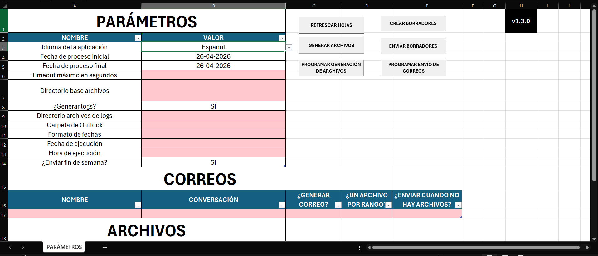
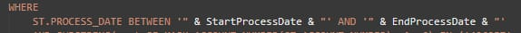

# Excel para envío de correos automáticos v1.0.0



## Descripción
Archivo de Excel que utiliza macros, Power Query y el lenguaje de programación Visual Basic para generar y enviar automáticamente reportes diarios tomando como origen de datos SQL Server. El repositorio de GitHub con el código se puede encontrar en haciendo clic en el siguiente enlace: [Repositorio de GitHub](https://github.com/elvladi15/excel-report-automation)

## Configuración inicial

Cuando se abre el archivo por primera vez, puede que Excel imprima ciertas alertas previniendo la ejecución de código externo (macros), conexiones a orígenes de datos externos, etc. Para asegurarse de que el archivo funcione correctamente, es necesario habilitar los macros en el Trust Center, así como hacer que el archivo confíe en las conexiones remotas. Esto último se puede lograr navegando hacia ***File > Options > Trust Center > Trust Center Settings > External Content >*** habilitar las opciones: ***Enable all Data Connections*** y ***Enable automatic data refresh***.

Al conectarse por 1ra. vez a SQL Server, es posible que también salga alguna alerta para confirmar la conexión. La idea es que el archivo pueda consultar de la base de datos sin necesitad de que salgan los prompts de Excel. Los mensajes de confirmación al presionar los botones de la hoja de cálculo, como "Archivos generados exitosamente", son normales, pero los que te preguntan por confirmación de si confiar en un origen de datos, se debe de tratar de mitigar en las configuraciones de Excel.

## Documentación

La aplicación corre sobre una hoja de cálculo llamada PARAMETERS, donde se configuran los valores iniciales y se programan las acciones de generación y envío automático por medio de la aplicación de escritorio Outlook.

1. Para agregar un nuevo reporte, hay que abrir la herramienta nativa de Excel llamada Power Query, presionando Alt + F12 en el teclado, y crear un nuevo query asociado al reporte a generar (se puede duplicar uno de los ya existentes para conveniencia).

De todas formas, aquí está la plantilla:

```
let
    dateFormat = Record.Field(PARAMETERS{8}, Table.ColumnNames(PARAMETERS){1}),
    StartProcessDate = DateTime.ToText(Record.Field(PARAMETERS{1}, Table.ColumnNames(PARAMETERS){1}),[Format=dateFormat]),
    EndProcessDate = DateTime.ToText(Record.Field(PARAMETERS{2}, Table.ColumnNames(PARAMETERS){1}),[Format=dateFormat]),
    MaxTimeoutInSeconds = Int64.From(Record.Field(PARAMETERS{3}, Table.ColumnNames(PARAMETERS){1})),
    SQL =
    "
        {CONSULTA SQL AQUÍ}
    ",
    Attempt = try Sql.Database("SERDB08,3433", "CNT", [Query=SQL, CommandTimeout = #duration(0, 0, 0, MaxTimeoutInSeconds)]),
    Check = try Value.Type(Attempt[Value]),
    Result = if Check[HasError] then "ERROR WHEN FETCHING FROM THE DATABASE" else Attempt[Value]
in
    Result
```

Hay que llenar la variable "SQL" con la consulta de SQL Server.

1. Sustituir los filtros de fecha por las variables StartProcessDate y EndProcessDate que vienen en el script para que a la hora de construir el script SQL, utilice las variables que vienen de la hoja de cálculo de la tabla PARAMETERS

Ejemplo:



1. Agregar la columna PROCESS_DATE_FOR_RANGE devolviendo la misma fecha que se filtra. Esta columna no aparecerá en los reportes. Es necesaria para que Power Query pueda obtener y filtrar la data 1 sola vez por reporte, en caso de que se vayan a generar múltiples archivos en 1 corrida, y no conectarse múltiples veces a la base de datos.

1. Hacer clic en Done y revisar si el Query retorna los datos. De ser así, colocarle un nombre reporte en snake_case, sustituyendo los espacios por guión de piso.

1. En la pestaña Home, ir a Close > Close & Load > Close & Load To... y se selecciona para cargar en una hoja de cálculo nueva.

1. A esta hoja de cálculo, colocarle el mismo nombre que tiene el Query.

### Hoja de cálculo "PARÁMETROS"

Esta es la hoja de cálculo principal, en la cual se especifican los detalles de los correos y archivos a generar/enviar.

### Descripción de parámetros

1. ***Idioma de la aplicación***: Selector de idioma de la aplicación. En los releases siempre tendrá el valor en inglés por defecto, pero se puede cambiar a español.
1. ***Fecha de proceso inicial***: Fecha de proceso inicial. Por defecto, contiene una fórmula para referirse al día de ayer.
1. ***Fecha de proceso final***: Fecha de proceso final. Por defecto, contiene una fórmula para referirse al día de ayer.
1. ***Timeout máximo en segundos***: cantidad máxima de segundos que el query va a esperar una respuesta de la base de datos.
1. ***Directorio base archivos***: Ruta en donde se guardarán los archivos.
1. ***¿Generar logs?***: Si se desea que la aplicación genere logs.
1. ***Directorio archivos de logs***: en caso de querer generar logs, especificar la ruta donde se guardarán los mismos.
1. ***Carpeta de Outlook***: El folder en Outlook donde se buscarán las conversaciones/asuntos para responder la línea de correos automáticamente.
1. ***Formato de fechas***: El formato de fechas que aparecerá al generar el archivo, logs y mensajes en la aplicación.
1. ***Hora de ejecución***: Hora a la que se programará la generación y/o envío de correos.

### Tabla CORREOS

Esta tabla contiene todas las instancias de correo que se enviarán, o correos a generar. Una fila corresponde a un correo que puede contener 1 o varios archivos.

Las columnas son las siguientes:

1. ***NOMBRE***: El nombre del correo. preferiblemente colocar en mayúscula, separado por guión de piso.
1. ***CONVERSACION***: El nombre del asunto de la línea de correos en Outlook, en la carpeta del parámetro ***Carpeta de Outlook***
1. ***GENERAR CORREO?***: Variable que activa/desactiva la generación/envío de correos. Si el valor es NO, este correo no se tomará en cuenta en la programación.
1. ***¿UN ARCHIVO POR RANGO?***: En caso de ser SI, siempre se generará 1 archivo en el rango de fechas establecido. Ejemplo: si el rango de fecha es: 2025-12-01 a 2025-12-31, se generará 1 archivo en ese rango de fechas. En caso de que sea NO, se generarán 31 archivos, cada uno de 1 fecha del rango.
1. ***¿ENVIAR CUANDO NO HAY ARCHIVOS?***: En caso de ser SI y el correo no tenga archivos a ser adjuntados, el correo aún así se enviará diciendo que no hubo datos para generar los archivos.

### Tabla ARCHIVOS

Contiene los archivos que se generarán por correo, así como el nombre del mismo.

Las columnas son las siguientes:

1. ***NOMBRE***: El nombre base del archivo. Al final del nombre del archivo se le agregará la fecha, o rango de fechas, al que corresponde.
1. ***CORREO***: El nombre del correo al que pertenece el archivo.

### Tabla REPORTES

Contiene los reportes que se generarán los archivos. Cada reporte representa una hoja de cálculo en el archivo final, así como una hoja de cálculo en el mismo Excel, obtenida desde Power Query.

1. ***NOMBRE***: El nombre del reporte. Debe existir una hoja de cálculo con el mismo nombre, que haga referencia a una consulta de Power Query.
1. ***ARCHIVO***: El nombre del archivo al que pertenece el reporte.

### Botones

La aplicación contiene 6 botones que permiten no sólo programar las ejecuciones automáticas, sino también poder ejecutar manualmente cada paso del flujo de ejecución.

### Flujo de ejecución completo

1. ***REFRESCAR HOJAS***: Primero se actualizan los reportes con el rango de fecha y configuraciones actuales.
1. ***GENERAR ARCHIVOS***: Una vez los reportes actualizados, se procede a generar todos los archivos ya actualizados.
1. ***CREAR BORRADORES***: Se crearán los borradores con los archivos ya generados en la ruta ***Directorio base reportes***
1. ***ENVIAR BORRADORES***: Una vez los borradores estén creados, se procederá a enviarlos.

Cada paso en el flujo tiene su propio botón.

Los botones ***PROGRAMAR GENERACIÓN DE ARCHIVOS*** y ***PROGRAMAR ENVÍO DE CORREOS*** configuran la ejecución automática de generación de archivos, y generación + envío, respectivamente. ***PROGRAMAR ENVÍO DE CORREOS*** programa el flujo completo, mientras que ***PROGRAMAR GENERACIÓN DE ARCHIVOS*** programa sólo los 2 primeros pasos del flujo.

## Documentación Técnica

El IDE utilizado fue Visual Studio Code, haciendo uso de la interfaz de línea de comandos (CLI) xlwings, el cual es un programa que extrae los archivos .bas del Excel, pudiendo editar en cualquier IDE de conveniencia y facilidad de documentación y control de versiones. Aquí está el release de GitHub utilizado [release de GitHub utilizado](https://github.com/xlwings/xlwings/releases/tag/0.33.18).

La primera línea de cada módulo en los archivos .bas es utilizado por xlwings para referenciar los módulos correspondientes en el Excel.

El punto de partida del código es el archivo [ModMain.bas](./ModMain.bas), el cual es llamado por todos los botones de la hoja de cálculo. Dependiendo del botón, se decide a cuál método delegarse la ejecución.

Para la corrida automática, el punto de partida siempre es el método AutomaticRun, ubicado en el archivo [ModAutomationProcess.bas](./ModAutomationProcess.bas).

El pdf de la documentación fue creado con la extensión de Visual Studio Code llamada [Markdonw PDF](https://marketplace.visualstudio.com/items?itemName=yzane.markdown-pdf) hecha por yzane.