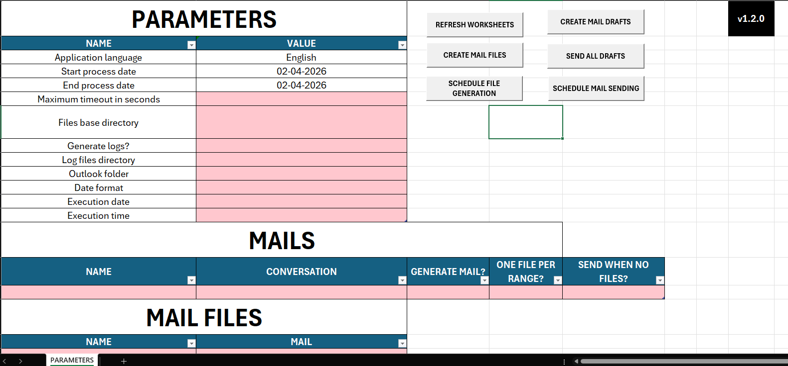

### Languages

[](https://github.com/elvladi15/excel-report-automation/blob/main/README.md)
[](https://github.com/elvladi15/excel-report-automation/blob/main/README.es.md)

# Excel for Automatic Email Sending v1.1.0



## Description
Excel file that uses macros, Power Query, and the VBA language to automate report generation and email sending.

This project was created to solve a recurring need to generate reports from SQL Server and send them automatically via email.

The source code is available on GitHub:  
https://github.com/elvladi15/excel-report-automation

## Initial Setup
When opening the file for the first time, Excel may display alerts warning about the execution of external code (macros), connections to external data sources, etc. To ensure the file works correctly, it is necessary to enable macros in the Trust Center and allow the file to trust remote data connections. This can be done by navigating to ***File > Options > Trust Center > Trust Center Settings > External Content >*** and enabling the options: ***Enable all Data Connections*** and ***Enable automatic data refresh***.

When connecting to SQL Server for the first time, Excel may also display an alert asking to confirm the connection. The goal is for the file to be able to query the database without Excel prompts appearing. Confirmation messages shown when pressing worksheet buttons, such as "Files generated successfully", are normal; however, prompts asking whether to trust a data source should be mitigated through Excel configuration settings.

## Documentation

The application runs on a worksheet called **PARAMETERS**, where the initial values are configured and the automatic report generation and email sending actions are scheduled through the Outlook desktop application.

1. To add a new report, open Excel’s native tool called **Power Query** by pressing **Alt + F12** on the keyboard, and create a new query associated with the report to be generated (you may duplicate an existing one for convenience).

In any case, here is the template:

```
let
    dateFormat = Record.Field(PARAMETERS{8}, Table.ColumnNames(PARAMETERS){1}),
    StartProcessDate = DateTime.ToText(Record.Field(PARAMETERS{1}, Table.ColumnNames(PARAMETERS){1}),[Format=dateFormat]),
    EndProcessDate = DateTime.ToText(Record.Field(PARAMETERS{2}, Table.ColumnNames(PARAMETERS){1}),[Format=dateFormat]),
    MaxTimeoutInSeconds = Int64.From(Record.Field(PARAMETERS{3}, Table.ColumnNames(PARAMETERS){1})),
    SQL =
    "
        {SQL QUERY HERE}
    ",
    Attempt = try Sql.Database("SERDB08,3433", "CNT", [Query=SQL, CommandTimeout = #duration(0, 0, 0, MaxTimeoutInSeconds)]),
    Check = try Value.Type(Attempt[Value]),
    Result = if Check[HasError] then "ERROR WHEN FETCHING FROM THE DATABASE" else Attempt[Value]
in
    Result
```

You must populate the **SQL** variable with the SQL Server query.

The dateFormat variable can be assigned an static value if needed, for example, for Oracle query compatibility with date columns.

1. Replace the date filters with the variables **StartProcessDate** and **EndProcessDate** included in the script, so that when the SQL script is built, it uses the values coming from the **PARAMETERS** worksheet table.

Example:


1. Add the column **PROCESS_DATE_FOR_RANGE**, returning the same date that is being filtered. This column will not appear in the reports. It is required so that Power Query can retrieve and filter the data only once per report, in case multiple files are generated in a single run, avoiding multiple connections to the database.

1. Click **Done** and verify that the query returns data. If so, assign a report name in **snake_case**, replacing spaces with underscores.

1. In the **Home** tab, go to **Close > Close & Load > Close & Load To...**, and select to load it into a new worksheet.

1. Assign this worksheet the same name as the Query.

### "PARAMETERS" Worksheet

This is the main worksheet, where the details of the emails and files to be generated and/or sent are specified.

### Parameter Description

1. ***Application language***: Language of the application, by default, English. Can also be changed to Spanish.
1. ***Start process date***: Initial process date. By default, it contains a formula that refers to yesterday.
1. ***End process date***: Final process date. By default, it contains a formula that refers to yesterday.
1. ***Maximum timeout in seconds***: Maximum number of seconds the query will wait for a response from the database.
1. ***Files base directory***: Path where the files will be saved.
1. ***Generate logs?***: Whether the application should generate logs or not.
1. ***Log files directory***: If logs are enabled, the path where they will be stored.
1. ***Outlook folder***: The Outlook folder where conversations/subjects will be searched to automatically reply to email threads.
1. ***Date format***: Date format used when generating files, logs, and application messages.
1. ***Execution time***: Time at which report generation and/or email sending will be scheduled.

### MAILS Table

This table contains all the email instances to be sent or generated. Each row corresponds to one email, which may contain one or multiple files.

The columns are:

1. ***NAME***: Email name. Preferably uppercase and separated by underscores.
1. ***CONVERSATION***: Subject name of the email thread in Outlook, located in the folder specified by ***Carpeta de Outlook***.
1. ***GENERATE MAIL?***: Flag that enables/disables email generation/sending. If the value is NO, this email will not be included in the scheduling.
1. ***ONE FILE PER RANGE?***: If YES, one file will always be generated for the specified date range. Example: if the date range is 2025-12-01 to 2025-12-31, one file will be generated for that range. If NO, 31 files will be generated, one per date in the range.
1. ***SEND WHEN NO FILES?***: If YES and the mail doesn't have files to be attached, the mail will still be sent saying that there was no data to generate the reports.

### MAIL_FILES Table

Contains the files that will be generated per email, along with their names.

The columns are:

1. ***NAME***: Base file name. The date or date range corresponding to the file will be appended to the end of the name.
1. ***MAIL***: Name of the email to which the file belongs.

### FILE_REPORTS Table

Contains the reports used to generate the files. Each report represents a worksheet in the final file, as well as a worksheet in the same Excel file obtained from Power Query.

1. ***NAME***: Report name. A worksheet with the same name must exist and reference a Power Query query.
1. ***MAIL_FILE***: Name of the file to which the report belongs.

### Buttons

The application contains 6 buttons that allow not only scheduling automatic executions, but also manually executing each step of the process flow.

### Complete Execution Flow

1. ***REFRESH WORKSHEETS***: Reports are first updated using the current date range and configuration.
1. ***CREATE MAIL FILES***: Once reports are updated, all corresponding files are generated.
1. ***CREATE MAIL DRAFTS***: Drafts are created with the generated files located in ***Directorio base reportes***.
1. ***SEND ALL DRAFTS***: Once drafts are created, they are sent.

Each of the 4 steps in the flow has its own button.

The buttons ***SCHEDULE FILE GENERATION*** and ***SCHEDULE MAIL SENDING*** configure the automatic execution of file generation, and generation + sending, respectively. ***SCHEDULE MILE SENDING*** schedules the full flow, while ***SCHEDULE FILE GENERATION*** schedules only the first 2 steps of the flow.

## Technical Documentation

The IDE used was **Visual Studio Code**, using the Excel integration provided by the **xlwings** extension.  
The specific version used can be found here:  
https://github.com/xlwings/xlwings/releases/tag/0.33.18

The first line of each module in the `.bas` files is used by xlwings to reference the corresponding modules within Excel.

The entry point of the code is the file `ModMain.bas`.  
From there, execution is delegated to different procedures depending on the button pressed.

For automated execution, the entry point is always the `StartAutomationProcess` method located in the file `ModAutomationProcess.bas`.

The PDF documentation was created using the Visual Studio Code extension  
**Markdown PDF** by yzane:  
https://marketplace.visualstudio.com/items?itemName=yzane.markdown-pdf